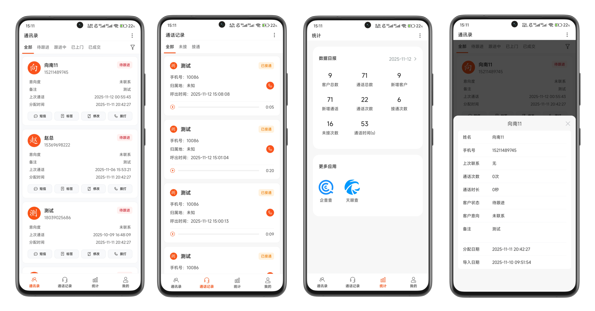

# 外呼助手

## App说明

**用uniapp开发的外呼系统**，接电话、管客户、看数据一套搞定。自带通话统计和录音功能，中小企业直接能用，二次开发也很方便！

**App外呼**是通过手机自带的通话功能，不是云呼。

**上传通话录音**是提前让用户开启通话自动录音，然后App去读取通话完成后产生的录音文件，来实现通话录音上传

APP代码的相关说明：<https://nicen.cn/8245.html>、<https://nicen.cn/8524.html>

## V2版

V2版本（同下方演示图一致）不再通过html5plus来读取和操作录音文件（html5plus在录音文件很多的时候，读取会变得很卡）。 

新版优化后代码更规范、性能更强，基于uniappx插件实现安卓原生获取、操作录音文件的方法，然后通过和webview通信，将方法暴露给前端JS调用。

> 项目内包含前端以及APP的完整代码，无后端代码。可自行编译项目代码，然后使用下方演示接口和账号来测试运行。（Web环境无法调用APP功能，体验具体功能请自行编译APP）

## v1版

旧版代码地址：<https://github.com/friend-nicen/unicall/tree/4c3b3c43402437d70acbdf517cee8339514cbd5e>

> V1版所有功能通过html5plus实现，项目内包含前端以及APP的完整代码，无后端代码。| **[H5页面演示版](./tree/4c3b3c43402437d70acbdf517cee8339514cbd5e)**（Web环境无法调用APP功能，体验具体功能请自行编译APP）

## 商业项目

开源的是App端的完整代码，不包含后端接口。

下面是一个实现了外呼相关基础功能的完整项目，后端是PHP、后台是Vue3。 新版在开源版的基础上重构而成，性能更好，代码更规范，功能更丰富。

* 后台地址：<https://call.nicen.cn/trial?as=admin>
* APP下载地址：<https://cdn3.nicen.cn/call.apk?v=1.1>
* 测试账号：ali 123456

> 如有需要请加wx good7341

## 快速开始

H5直接编译成可用的生成环境测试代码。APP需要自行打包，将`app\pages\index\index.vue`内的地址改成编译之后的H5页面地址，即可正常使用。

用Hbuilder调试时，自带的调试应用是没有读取通话记录权限的，所以必须打包自定义调试基座、或者自行打包后，APP才能读取通话记录，正常运行。

## 核心功能

### 智能外呼

- 自动记录通话时长和次数
- 支持通话自动录音
- 支持一键拨号、短信快捷发送

### 数据管理

- 客户信息智能管理
- CRM系统无缝对接
- 通话数据实时同步

### 便捷工具

- 通讯录智能管理
- 工作报表自动生成

## 合作

- 微信联系：good7341